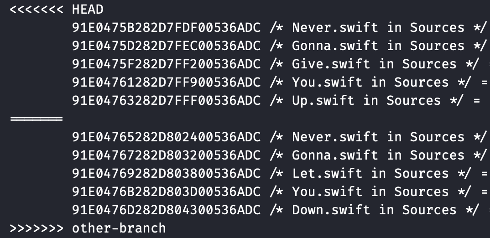
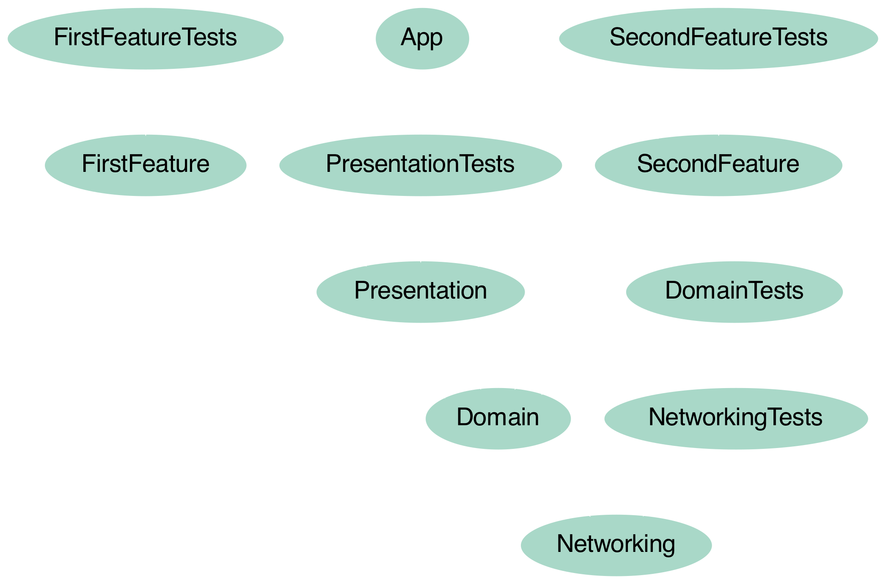
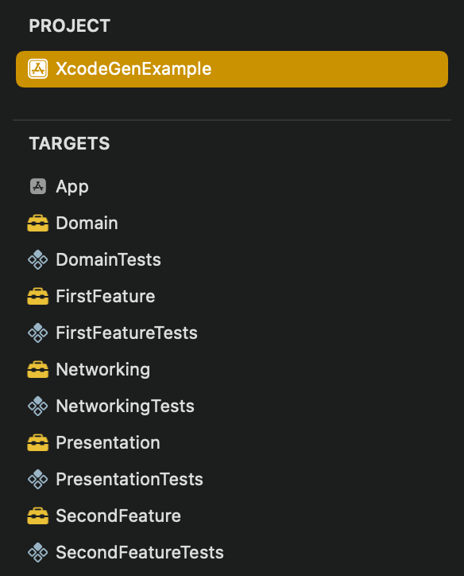
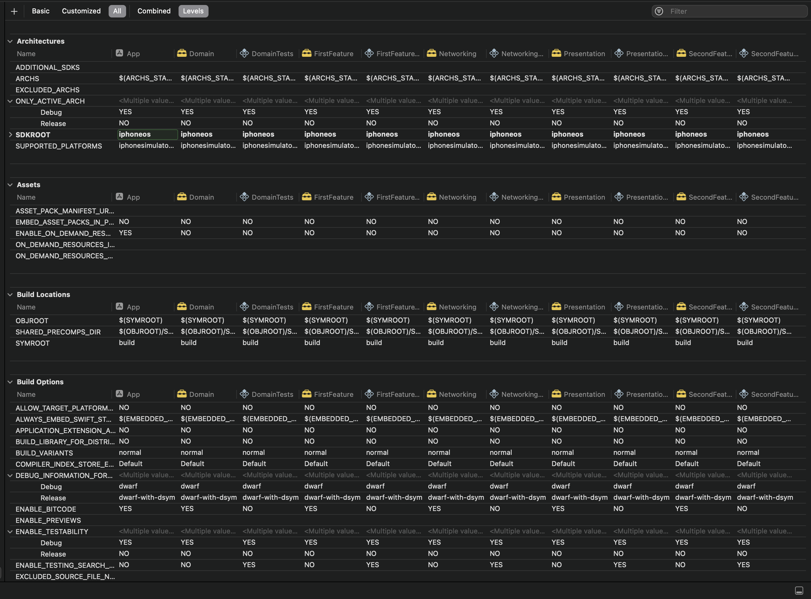
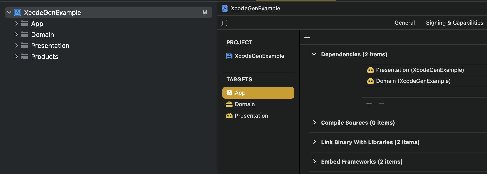

build-lists: true
slidenumbers: true
autoscale: true
theme: My Fira

[.header: alignment(center)]
# **XcodeGen**
# Why & How?

#### Sebastian Osiński
---

[.header: alignment(center)]
# Senior iOS Engineer
### @


---

# WARNING!

---

## [fit] ⚠️ No Swift Code Ahead ⚠️

---

## [fit] ⚠️ YAMLing in progress ⚠️

---

# Why?
## The pains of **Xcode**

---

# Collaboration

^ Multiple developers
Faster progress
Simultaneous features
Conflicts!

---

# Working with other developers
## Expectation:


---

# Working with other developers
## Reality:



---

# [fit] Modularization

---

# Modularized projects
## Expectation:



---

# Modularized projects
## Reality:



---

# Modularized projects
## Reality:



---

# How?

---

## Solution:
# **XcodeGen 🛠**

---

# Goodbye<br>**.xcodeproj** 👋🏼

---

# Welcome<br>**project.yml** 🎉

---

# XcodeGen

- generates .xcodeproj for you based on YAML/JSON config file and project's file structure
- config file **editable**, **readable** and **mergable** by humans

^ Mergable but in reality, there won't be many conflicts in there, if any

---

# Installation

<br>
<br>

```bash
> brew install xcodegen
```

^ or MINT, or SPM

---

## project.yml

[.code-highlight: none]
[.code-highlight: 1]
[.code-highlight: 2-4]
[.code-highlight: 5]
[.code-highlight: 6-13]
[.code-highlight: all]

```yaml
name: XcodeGenExample
options:
  bundleIdPrefix: dev.osinski
  deploymentTarget: "15.0"
targets:
  App:
    type: application
    platform: iOS
    sources:
      - App
    dependencies:
      - target: Presentation
      - target: Domain
  Presentation:
    type: framework
    platform: iOS
    sources:
      - Presentation
  Domain:
    type: framework
    platform: iOS
    sources:
      - Domain  
```

^ Simplified, no unit test targets, but of course possible.
All types of targets are supported

---

# Usage

<br>

```shell
> xcodegen generate
⚙️  Generating plists...
⚙️  Generating project...
⚙️  Writing project...
Created project at XcodeGenExample/XcodeGenExample.xcodeproj
```

---

# Generated project



---

# **Problem:**
## Kinda repetitive 

---

## Solution:
# **Templates**

---

# Templates

[.code-highlight: none]
[.code-highlight: 1]
[.code-highlight: 2]
[.code-highlight: 2-5]
[.code-highlight: 6]
[.code-highlight: 6-9]
[.code-highlight: all]

```yaml
targetTemplates:
  BaseModule:
    platform: iOS
    sources:
      - ${target_name}
  FrameworkModule:
    templates:
      - BaseModule
    type: framework
```

^ Sources can be more complicated:
- exclusion rules based on file names etc.

---

## project.yml revisited

[.code-highlight: none]
[.code-highlight: 1-2]
[.code-highlight: 4-10]
[.code-highlight: 11-16]
[.code-highlight: all]
```yaml
include:
  - templates.yml
targets:
  App:
    templates:
      - BaseModule
    type: application
    dependencies:
      - target: Presentation
      - target: Domain
  Presentation:
    templates:
      - FrameworkModule
  Domain:
    templates:
      - FrameworkModule
```

---

# [fit] What else can it do?

---

# Build settings

```yaml
settings:
  base:
    SWIFT_OBJC_BRIDGING_HEADER: BridgingHeader.h
    OTHER_LDFLAGS:
      - "-ObjC"
    USER_HEADER_SEARCH_PATHS:
      - $(PROJECT_DIR)/Headers/**
    # Very weird bug haunting only this app
    # See rdar://123456789
    VERY_OBSCURE_BUT_IMPORTANT_SETTING:
      - "-Foobarize"
```

^ Same key names as in Xcode build settings
You can add comments

---

# Build settings

```yaml
settings:
  base:
    SWIFT_OBJC_BRIDGING_HEADER: BridgingHeader.h
  configs:
    Debug:
      SOME_SETTING: "Foo"
    Release:
      SOME_SETTING: "Bar"
```

^ Different settings for different configs

---

# Info.plist

```yaml
info:
  path: Info.plist
  properties:
    CFBundleDisplayName: Awesome App
    ITSAppUsesNonExemptEncryption: false
    NSLocationWhenInUseUsageDescription: We want to know
    UIBackgroundModes:
      - remote-notification
    MyOwnInfoPlistKey: SomeValue
```

^ Generated by default, but we can customise it
We can opt out from generation too

---

# Entitlements

```yaml
entitlements:
  path: App.entitlements
  properties:
    aps-environment: development
    com.apple.developer.associated-domains:
      - webcredentials:osinski.dev
      - applinks:osinski.dev
```

---

# Build phase scripts

[.code-highlight: all]
[.code-highlight: 1-7]
[.code-highlight: 8-10]
[.code-highlight: 11-13]
[.code-highlight: all]
```yaml
preBuildScripts:
  - path: scripts/pre_build_script.sh
    name: First Script
    inputFiles:
      - $(SRCROOT)/input
    outputFiles:
      - $(DERIVED_FILE_DIR)/output
postCompileScripts:
  - script: some_shell_command -a
    name: My Command Script
postBuildScripts:
  - path: script/post_build_script.sh
    name: Final Script
```

---

# Subprojects

<br>

```yaml
projectReferences:
  SomeSubproject:
    path: "./Subproject/Subproject.xcodeproj"
```

---

# **It can do much much more...**


---

# XcodeGen & **Package Managers**

---

# Swift Package Manager

```yaml
packages:
  AwesomePackage:
    url: https://github.com/somebody/AwesomePackage
    from: 1.2.3
targets:
  TargetName:
    dependencies:
      - package: AwesomePackage
```

---

# Carthage

<br>

```yaml
TargetName:
  dependencies:
    - carthage: SomeAwesomeLibrary
```

^ Use Cartfile as normal

--- 

# CocoaPods

<br>
<br>

```yaml
options:
  postGenCommand: pod install
```

^ Use Podfile as normal

---

# CocoaPods

```shell
> xcodegen generate
⚙️  Generating plists...
⚙️  Generating project...
⚙️  Writing project...
Created project at XcodeGenExample/XcodeGenExample.xcodeproj
Analyzing dependencies
Downloading dependencies
Generating Pods project
Integrating client project
Pod installation complete!
```

---

# XcodeGen & **Existing projects**

---

## Solution:
# **xcdiff**

---

# xcdiff

[.code-highlight: all]
[.code-highlight: 1]
[.code-highlight: 2]
[.code-highlight: 7]
[.code-highlight: all]
```shell
> xcdiff -p1 original.xcodeproj -p2 xcodegen_generated.xcodeproj
❌ FILE_REFERENCES
❌ TARGETS > NATIVE targets
✅ TARGETS > AGGREGATE targets
✅ CONFIGURATIONS > Root project
✅ SETTINGS > Root project > "Debug" configuration > Base configuration
❌ SETTINGS > Root project > "Debug" configuration > Values
✅ SETTINGS > Root project > "Release" configuration > Base configuration
❌ SETTINGS > Root project > "Release" configuration > Values
❌ SOURCE_TREES > Root project
❌ ATTRIBUTES > Root project
✅ SWIFT_PACKAGES
```

---

# xcdiff --verbose

[.code-highlight: all]
[.code-highlight: 1]
[.code-highlight: 3-7]
[.code-highlight: 9-11]
[.code-highlight: all]
```shell
> xcdiff -p1 original.xcodeproj -p2 xcodegen_generated.xcodeproj --verbose
...
❌ SETTINGS > Root project > "Debug" configuration > Values
⚠️  Value mismatch (1):
  • IPHONEOS_DEPLOYMENT_TARGET
    ◦ 14.0
    ◦ 15.4
...
❌ ATTRIBUTES > Root project
⚠️  Only in first (1):
  • ORGANIZATIONNAME = Sebastian Osiński
...
```

---

# Good practices

---

# Use cache to speed project generation

<br>
<br>

```shell
> xcodegen generate --use-cache
Project has not changed since cache was written
```

---

# Use git hooks

```shell
> git checkout main
Switched to branch 'main'
Your branch is up to date with 'origin/main'.
⚙️  Generating plists...
⚙️  Generating project...
⚙️  Writing project...
Created project at XcodeGenExample/XcodeGenExample.xcodeproj
```
---

# Split project.yml into multiple files

```yaml
name: TheApp
include:
- xcodegen/templates.yml
- xcodegen/app.yml
- xcodegen/modules.yml
- xcodegen/ui_tests.yml
```

---

# Getting rid of **XcodeGen**

^ 3rd party lock-in
What if it stops being maintained
What if Apple decides to revamp Xcode projects

---

# Getting rid of XcodeGen

<br>

1. Run XcodeGen one last time 🛠
2. Start tracking `.xcodeproj` file with git 💾
3. Stop using XcodeGen ✅

---

# **XcodeGen**
## vs
# **Tuist**

---

[.column]
# **XcodeGen**

- YAML/JSON 
- simple
- sometimes hard to debug
- fairly easy to integrate with complicated projects

[.column]
# **Tuist**

- Swift 
- compile time safety
- history of major breaking changes
- integration problems due to its strictness 

---

# Thank you!

---

# Resources
[.build-lists: false]
<br>

- https://github.com/yonaskolb/XcodeGen
- https://github.com/bloomberg/xcdiff

---

## Getting in touch

### :earth_africa: **OSINSKI.DEV**
### :bird: **@seb_osinski**

---
[.header: alignment(center)]
# Q&A
